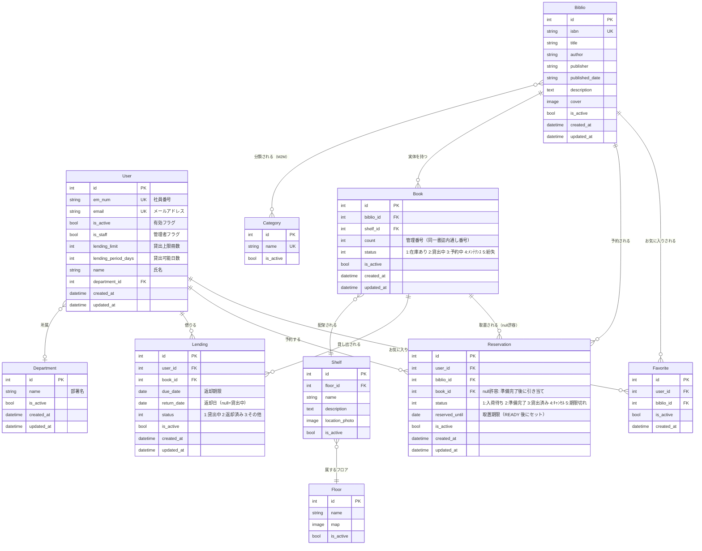

[](https://www.python.org/)
[](https://www.djangoproject.com/)
[](https://github.com/astral-sh/ruff)
[](https://sqlite.org/)

# DecenLib - 分散型図書管理システム

## 概要
オフィス内などで分散する書籍をローコストで有効活用する、分散型図書館Webアプリケーション


## URL

(URL)

テスト用ログインユーザー情報：（）

---

## プロジェクトの背景と課題

このプロジェクトは、アプリケーション開発の一連の流れを学習することを目的として、架空の企業からの依頼を想定し、作成したものです。

*   **課題**:多数のフロアや棚に分散した蔵書を活用したいが、専用のスペースや人員を用意する余裕がない。

*   **解決策**: ウェブアプリケーション上で書籍の表示、検索機能を実装することで、物理的には分散させたまま、必要な書籍へのアクセスを可能にする。  
また、アプリケーション内で貸出、返却機能を実装することで、利用者の端末のみで貸し借りのサイクルを完結させ、司書の常駐を不要とした。


---

## アプリケーションのイメージ

| トップ画面 |　ログイン画面 |
| ---- | ---- |
|  | |
|  |  |

| ダッシュボード |　書籍詳細 |
| ---- | ---- |
| ||
|  |  |

| 書籍一覧 |　ユーザーページ |
| ---- | ---- |
|  | |
|  |  |

---

##  技術的ハイライト & アーキテクチャ設計


### 1. Basemodelクラスの継承によって、論理削除等の基本機能を全モデル共通実装

django標準のmodels.modelを継承したBasemodelクラス及び

### 2. データーの取得を、ビューが継承したmixinによって行うことでN＋１問題を解決


### 3. 実在の書籍と書誌情報の分離

### 4.書誌情報に対して予約を作成し、その後実在書籍に引き当てるロジック構築

##  将来の拡張ロードマップ (TODO)

本プロジェクトは以下の機能拡張を将来の課題として想定しています。

1.  **通知システム**: 予約書籍の準備完了通知や返却期限警告の自動通知機能。
2.  **外部API連携**: Google Books API等と連携し、ISBN入力による書籍情報の自動取得。
3.  **非同期UXの向上**: `htmx` を用いた「お気に入り登録」や「貸出申請」の非同期 (Ajax) 通信化。
4.  **E2Eテスト作成**: praywright等を用いたE2Eテストの作成。


##  技術スタック

*   **言語/フレームワーク**: Python 3.14 / Django 6.0.2
*   **フロントエンド**: HTML5 / Vanilla CSS / Bootstrap 5 / django-widget-tweaks
*   **静的解析・品質保証**: Ruff (Linter & Formatter) 
*   **データベース**: SQLite3
*   **テスト・シードデータ**: factory_boy / Faker

---


##  データモデル設計

### 2.1. ER図

全 10 モデルのリレーションを示します。




---


## 5. クイックスタート (セットアップ・起動手順)


ローカル環境で本システムを起動するための手順です。

### 5.1. 依存パッケージのインストール
仮想環境を作成・アクティベートした状態で、以下のコマンドを実行します。
```bash
pip install -r requirements.txt
```

### 5.2. データベースマイグレーション
データベースの初期化とテーブル作成を行います。
```bash
python library/manage.py migrate
```

### 5.3. デモデータの自動生成（シードデータの挿入）
FakerとFactory Boyを利用し、テスト用のダミーデータ（部署、ユーザー、本棚、蔵書、貸出履歴など）を一括生成します。
```bash
python library/seed_data.py
```
> [!WARNING]
> このスクリプトを実行すると、既存のデータベースレコード（管理者以外の全データ）が一掃（`hard_delete`）され、新しく再生成されます。

**自動生成されるデフォルトアカウント**:
*   管理者アカウント: `admin@example.com` / パスワード: `password123`

### 5.4. ローカルサーバーの起動
```bash
python library/manage.py runserver
```
起動後、ブラウザで `http://127.0.0.1:8000/` にアクセスして動作を確認します。

---

###  品質保証 & テスト実行


コード品質を担保するため、静的解析ツールと単体テストを導入しています。

*   **単体テストの実行**:
    ```bash
    python library/manage.py test library
    ```
*   **コードの整形・静的解析 (Linter / Formatter)**:
    ```bash
    ruff check .
    ```

---
