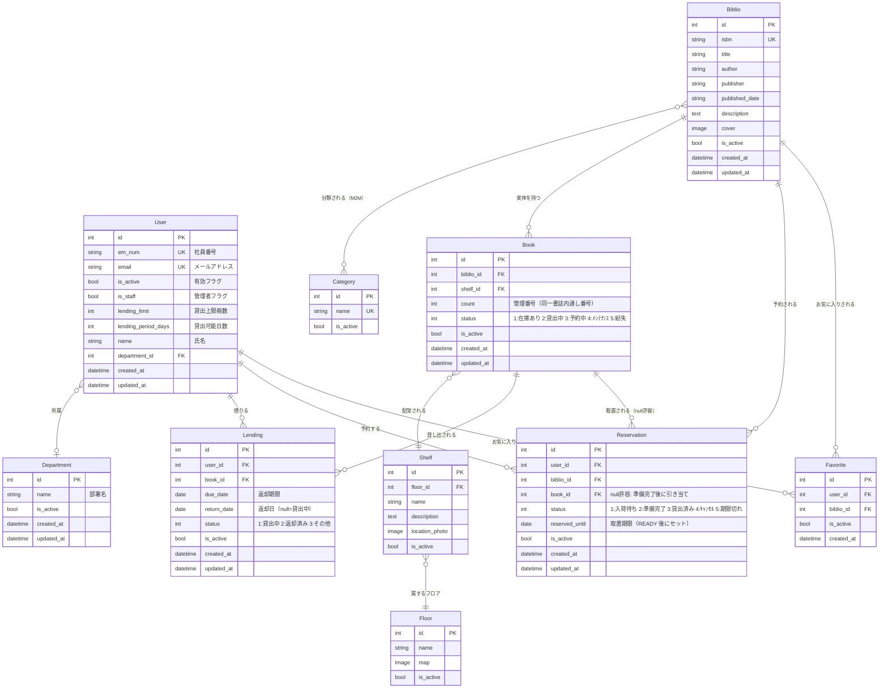
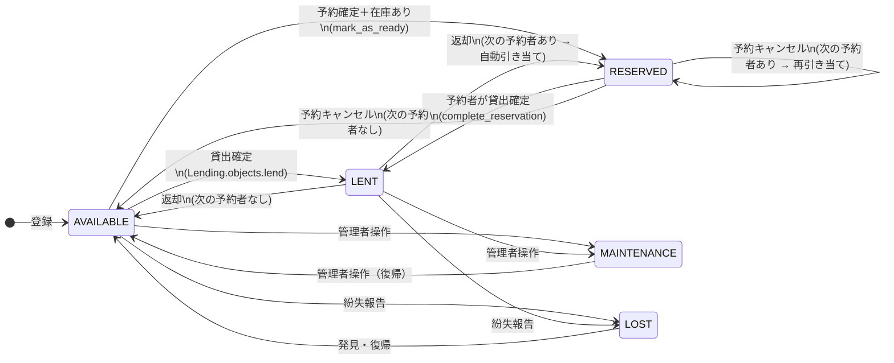
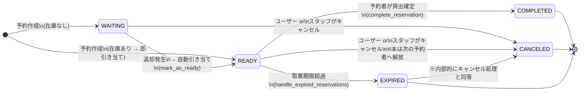

# Library - 仮想本棚を介した分散型図書管理システム

[](https://www.python.org/)
[](https://www.djangoproject.com/)
[](https://github.com/astral-sh/ruff)
[](https://sqlite.org/)

本システムは、広大なオフィスや研究施設内に分散配置された15,000冊・20フロアにおよぶ書籍を効率的に管理するための、Django製分散型図書管理アプリケーションのプロトタイプです。

---

## 1. プロジェクトの背景と課題

このプロジェクトは、アプリケーション開発の一連の流れを学習することを目的として、架空の企業からの依頼を想定し、作成したものです。

*   **課題**:多数のフロアや棚に分散した蔵書を活用したいが、専用のスペースや人員を用意する余裕がない。

*   **解決策**: ウェブアプリケーション上で書籍の表示、検索機能を実装することで、物理的には分散させたまま、必要な書籍へのアクセスを可能にする。  
また、アプリケーション内で貸出、返却機能を実装することで、利用者の端末のみで貸し借りのサイクルを完結させ、司書の常駐を不要とした。


---

## 2. データモデル設計

### 2.1. ER図

全 10 モデルのリレーションを示します。`Reservation.book` が点線（null 許容）である点に注目してください。予約時点では「どの個体を渡すか」は未確定であり、実際に返却が来て初めて特定の `Book` が引き当てられます（`mark_as_ready`）。



---

### 2.2. 状態遷移図 — 蔵書（Book）

`Book.status` は貸出・予約・返却の各トランザクションによって自動的に遷移します。管理者のみ `MAINTENANCE / LOST` へ手動で変更できます。



---

### 2.3. 状態遷移図 — 予約（Reservation）

`Reservation.status` のライフサイクルを示します。`WAITING → READY` の遷移は、返却トランザクション内で自動実行されます（`collect` → `mark_as_ready`）。取置期限（`reserved_until`）を過ぎた場合は、バッチ処理 `handle_expired_reservations` によって自動キャンセルされます。



---

## 3. 技術的ハイライト & アーキテクチャ設計

本アプリケーションは、Django 6.0の新機能を活用しつつ、パフォーマンスとメンテナンス性を最大化する設計パターンを採用しています。

### 3.1. N+1 クエリ問題の解決（階層型コンテキスト Mixin）
書籍一覧画面において、各書籍のユーザー個別ステータス（「お気に入り済みか」「現在貸出中か」「予約中か」）の判定に伴う $N$ 回の追加データベースアクセスを防ぐため、以下の最適化を行いました。
*   **単一責任の Mixin 設計**: お気に入り用・貸出用・予約用に Mixin を細分化し、それらを統合する `LibStatusMixin` （ファサードパターン）を構築。
*   **メモリと参照の最適化**: `.values_list('biblio_id', flat=True)` を使用して主キーのみを取得し、オブジェクト生成オーバーヘッドを回避。
*   **$O(1)$ 定数時間でのルックアップ**: データベースクエリの結果を Python の `set`（集合型）にキャストし、テンプレート側の判定処理（``）を線形時間 $O(n)$ から定数時間 $O(1)$ へ最適化。

> [!NOTE]
> 技術的な詳細や設計の選択肢については、[docs/ARCH_DESIGN.md](docs/ARCH_DESIGN.md) をご参照ください。

### 3.2. UI コンポーネント戦略
*   **二段階フォームコンポーネント**: 単一フィールドを描画する `_form_field.html` (Atom) と、フォーム全体を制御する `_form.html` (Molecule) に分割し、Bootstrap 5のバリデーションと一貫したUIを再利用可能にしています。
*   **レイアウト継承**: 認証系画面などのために `centered_card.html` などの特殊レイアウトを分離し、可読性と保守性を向上させています。

### 3.3. データ整合性と論理削除の統一
*   全モデルが `core.models.BaseModel` を継承し、論理削除（`is_active` フラグ）を一元管理しています。

---

## 4. 技術スタック

*   **言語/フレームワーク**: Python 3.14 / Django 6.0.2
*   **フロントエンド**: HTML5 / Vanilla CSS / Bootstrap 5 / django-widget-tweaks
*   **静的解析・品質保証**: Ruff (Linter & Formatter) 
*   **データベース**: SQLite3
*   **テスト・シードデータ**: factory_boy / Faker

---

## 5. クイックスタート (セットアップ・起動手順)

ローカル環境で本システムを起動するための手順です。

### 5.1. 依存パッケージのインストール
仮想環境を作成・アクティベートした状態で、以下のコマンドを実行します。
```bash
pip install -r requirements.txt
```

### 5.2. データベースマイグレーション
データベースの初期化とテーブル作成を行います。
```bash
python library/manage.py migrate
```

### 5.3. デモデータの自動生成（シードデータの挿入）
FakerとFactory Boyを利用し、テスト用のダミーデータ（部署、ユーザー、本棚、蔵書、貸出履歴など）を一括生成します。
```bash
python library/seed_data.py
```
> [!WARNING]
> このスクリプトを実行すると、既存のデータベースレコード（管理者以外の全データ）が一掃（`hard_delete`）され、新しく再生成されます。

**自動生成されるデフォルトアカウント**:
*   管理者アカウント: `admin@example.com` / パスワード: `password123`

### 5.4. ローカルサーバーの起動
```bash
python library/manage.py runserver
```
起動後、ブラウザで `http://127.0.0.1:8000/` にアクセスして動作を確認します。

---

## 6. 品質保証 & テスト実行

コード品質を担保するため、静的解析ツールと単体テストを導入しています。

*   **単体テストの実行**:
    ```bash
    python library/manage.py test library
    ```
*   **コードの整形・静的解析 (Linter / Formatter)**:
    ```bash
    ruff check .
    ```

---

## 7. 将来の拡張ロードマップ (TODO)

本プロジェクトは以下の機能拡張を将来の課題として想定しています。

1.  **通知システム**: 予約書籍の準備完了通知や返却期限警告の自動通知機能。
2.  **外部API連携**: Google Books API等と連携し、ISBN入力による書籍情報の自動取得。
3.  **非同期UXの向上**: `htmx` を用いた「お気に入り登録」や「貸出申請」の非同期 (Ajax) 通信化。
4.  **型定義の完全適合**: `django-stubs` の完全適合と、ジェネリックな QuerySet 型定義の導入。

> [!TIP]
> 拡張機能および解決すべき技術的負債の詳細は、[docs/TODO.md](docs/TODO.md) をご参照ください。
