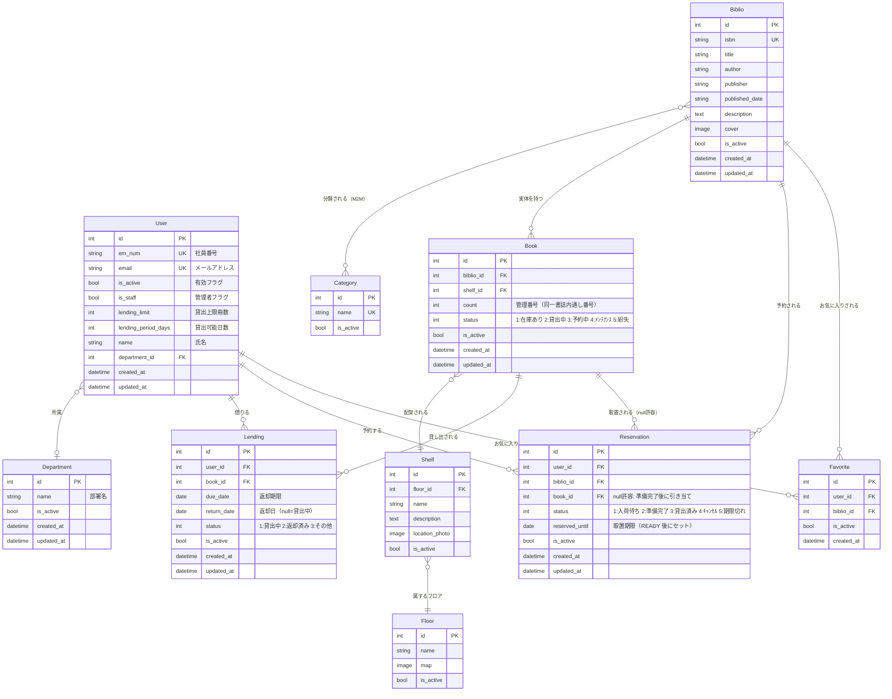

# Architectural Design & Rationale

This document describes the architectural decisions and technical challenges addressed in the Library project.

## 1. User Library Status Optimization (Hierarchical Mixins)

### 1.1. The Challenge: N+1 Query Problem
In book listing views (search results, category views), displaying the user's status for each book (e.g., "Is it favorited?", "Is it currently lent to me?") caused a significant performance bottleneck.
- **Root Cause:** Standard template filters or model methods performed a database query for *each* item in the loop, resulting in $N$ additional queries where $N$ is the number of books displayed.

### 1.2. The Solution: Hierarchical Context Mixins
We implemented a set of reusable Mixins in `core/views/mixins.py` to pre-fetch status data efficiently.

- **Granularity (Single Responsibility):**
    - `FavoriteContextMixin`: Fetches favorite book IDs.
    - `LendingContextMixin`: Fetches currently lent book IDs.
    - `ReservationContextMixin`: Fetches currently reserved book IDs.
- **Facade Pattern:** `LibStatusMixin` inherits all three, providing a single point of integration for views that require full status awareness.

### 1.3. Technical Optimizations
- **Memory Efficiency:** Used `.values_list('biblio_id', flat=True)` to fetch only the necessary primary keys, avoiding the overhead of instantiating full Django Model objects.
- **Lookup Performance:** Converted query results into Python `set` objects. This ensures that template-side checks (``) run in $O(1)$ constant time instead of $O(n)$ linear time.
- **Dependency Management:** Used local imports within methods to prevent circular dependency issues between the `core`, `catalog`, and `transactions` apps.

---

## 2. UI Component Strategy (Modular Forms & Layouts)

### 2.1. The Goal: Design Consistency and Development Speed
To maintain a high-quality, professional UI across all apps while accelerating development, we adopted a modular approach to templates.

### 2.2. Two-Tier Form Component Design
We separated form logic into two levels of granularity:
- **`_form_field.html` (Atom):** Manages the rendering of a single input field, including its label, required marker, Bootstrap 5 validation states (`is-invalid`), and help texts. This allows for custom layouts where fields are not simply linear.
- **`_form.html` (Molecule):** Manages the form container, CSRF tokens, non-field errors, and action buttons. It utilizes `_form_field.html` in a loop for standard forms but can be bypassed for complex layouts.

### 2.3. Layout Inheritance for Authentication
We introduced `centered_card.html` as a specialized layout for focused, single-purpose screens (login, registration, password changes). This ensures a consistent user experience and simplifies responsive design across all entry points.

---

## 1. ユーザーライブラリステータスの最適化（階層型 Mixin）

<aside>
### 1.1. 課題：N+1 クエリ問題
書籍一覧表示（検索結果やカテゴリ別リスト）において、各書籍に対するユーザー固有の状態（お気に入り済みか、貸出中か等）を確認する処理が、深刻なパフォーマンスのボトルネックとなっていました。
- **根本原因:** 標準的なテンプレートフィルタやモデルメソッドがループ内の各アイテムに対してデータベースクエリを実行するため、表示件数 $N$ に対して $N$ 回の追加クエリが発生していました。

### 1.2. 解決策：階層型コンテキスト Mixin
`core/views/mixins.py` に、状態データを効率的に事前取得するための再利用可能な Mixin 群を実装しました。

- **粒度の細分化（単一責任の原則）:**
    - `FavoriteContextMixin`: お気に入り書誌IDを取得。
    - `LendingContextMixin`: 貸出中書誌IDを取得。
    - `ReservationContextMixin`: 予約中書誌IDを取得。
- **ファサードパターン:** `LibStatusMixin` が上記3つを継承し、全ステータスを必要とするビューに対して単一の統合ポイントを提供します。

### 1.3. 技術的な最適化
- **メモリ効率:** `.values_list('biblio_id', flat=True)` を使用して必要な主キーのみを取得し、Django モデルオブジェクト全体のインスタンス化に伴うオーバーヘッドを回避しました。
- **検索パフォーマンス:** クエリ結果を Python の `set`（集合型）に変換しました。これにより、テンプレート側での判定（``）が $O(n)$ の線形時間ではなく $O(1)$ の定数時間で実行されることを保証します。
- **依存関係の管理:** `core`、`catalog`、`transactions` アプリ間の循環参照を防ぐため、メソッド内でのローカルインポートを採用しました。
</aside>

## 2. UI コンポーネント戦略（モジュール型フォームとレイアウト）

<aside>
### 2.1. 目的：デザインの一貫性と開発スピードの向上
全てのアプリで高品質かつプロフェッショナルな UI を維持しつつ、開発スピードを最大化するため、テンプレートのモジュール化を採用しました。

### 2.2. 二段階のフォームコンポーネント設計
フォームの表示ロジックを2つの粒度に分割しました：
- **`_form_field.html` (最小単位):** 単一の入力フィールド（ラベル、必須マーク、Bootstrap 5 のバリデーション状態、ヘルプテキスト）の描画を担当します。これにより、フィールドが単純に縦に並ばないカスタムレイアウトにも対応可能になります。
- **`_form.html` (構成単位):** フォームの枠組み、CSRF トークン、フォーム全体のエラー、アクションボタンを担当します。標準的なフォームではループ内で `_form_field.html` を呼び出しますが、複雑なレイアウトが必要な場合は個別にフィールドを配置することも可能です。

### 2.3. 認証系のためのレイアウト継承
ログイン、ユーザー登録、パスワード変更などの「単一目的で集中が必要な画面」のために `centered_card.html` を導入しました。これにより、一貫したユーザー体験を提供し、あらゆるエントリーポイントでのレスポンシブデザイン対応を簡略化しています。
</aside>

### 2.1. ER図

全 10 モデルのリレーションを示します。`Reservation.book` が点線（null 許容）である点に注目してください。予約時点では「どの個体を渡すか」は未確定であり、実際に返却が来て初めて特定の `Book` が引き当てられます（`mark_as_ready`）。

---
